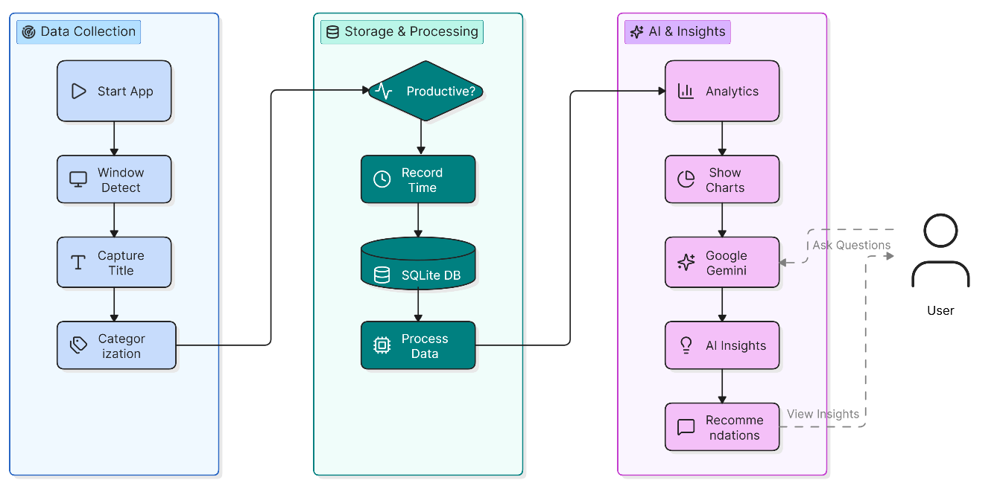

<div align="center">

# 🎯 FocusAI

### *An AI-powered productivity tracker that monitors digital activity, analyzes distraction patterns, and provides personalized productivity insights.*

<p>


</p>

</div>

---

# 📖 Overview

FocusAI is an AI-powered productivity tracking application designed to help users understand and reduce digital distractions.

The application automatically monitors the user's active application windows, identifies potentially distracting activities, categorizes application usage, and stores activity data for analysis.

Using **Google Gemini AI**, FocusAI analyzes productivity patterns and provides personalized recommendations to help users improve their focus and digital habits.

The platform combines **real-time activity tracking, local data storage, analytics, interactive visualizations, and AI-powered insights** into a single productivity dashboard.

---

# ✨ Features

### 🖥️ Activity Tracking

* Monitors active application windows in real time.
* Detects potentially distracting applications.
* Automatically records application usage duration.
* Tracks digital activity in the background.

### 🧠 Smart Activity Categorization

Applications and activities are automatically categorized into:

* 📱 Social Media
* 🎬 Entertainment
* 🌐 Browsing
* 💻 Development
* 💼 Work
* 📦 Other

### 📊 Productivity Dashboard

* View recent distraction records.
* Track total number of distractions.
* Monitor distraction duration.
* View productivity statistics.
* Interact with the AI productivity assistant.

### 🤖 AI Productivity Assistant

* Powered by Google Gemini API.
* Provides personalized productivity recommendations.
* Answers user questions related to focus and productivity.
* Analyzes activity patterns to generate actionable suggestions.

### 📈 Analytics & Insights

* Category-wise distraction analysis.
* Daily distraction trends.
* Time-slot productivity patterns.
* Productivity score visualization.
* AI-generated productivity insights.
* Interactive charts powered by Chart.js.

### 💾 Data Storage

* Uses SQLite for lightweight local storage.
* Automatically maintains activity and distraction logs.
* Stores historical data for analytics and trend analysis.

---

# 🏗️ System Architecture

<p align="center">
  
</p>

FocusAI follows a lightweight end-to-end architecture where the activity tracker continuously monitors the active window, processes and categorizes the activity, and stores the resulting data in SQLite.

The Flask backend retrieves this information to generate analytics and serves the productivity dashboard. Google Gemini is integrated as the AI layer to analyze productivity patterns and generate personalized recommendations.

---

# 🔄 How FocusAI Works

<p align="center">
  
</p>

The application follows this workflow:

1. 🖥️ The application detects the currently active window.
2. 🔍 The window title/application is analyzed.
3. 🧠 The activity is assigned to a predefined category.
4. ⏱️ Usage and distraction duration are calculated.
5. 💾 Activity information is stored in SQLite.
6. 📊 Historical data is processed to generate analytics.
7. 📈 Interactive charts visualize productivity and distraction patterns.
8. 🤖 Gemini AI analyzes the productivity data.
9. 💡 Personalized recommendations and productivity insights are presented to the user.

---

# 🛠️ Tech Stack

| Category                   | Technologies             |
| -------------------------- | ------------------------ |
| **Programming Language**   | Python                   |
| **Backend**                | Flask                    |
| **Database**               | SQLite                   |
| **Frontend**               | HTML, CSS, JavaScript    |
| **Visualization**          | Chart.js                 |
| **AI Integration**         | Google Gemini API        |
| **Activity Tracking**      | Active Window Monitoring |
| **Environment Management** | Python dotenv            |

---

# 📸 Application Preview

## 🏠 Home Page

<p align="center">
  
</p>

---

## 📊 Productivity Dashboard

<p align="center">
  
</p>

---

## 📈 Analytics Dashboard — Part 1

<p align="center">
  
</p>

---

## 📈 Analytics Dashboard — Part 2

<p align="center">
  
</p>

---

# ⚙️ Installation

### 1. Clone the Repository

```bash
git clone <repository-url>
cd FocusAI
```

### 2. Install Dependencies

```bash
pip install -r requirements.txt
```

### 3. Configure Environment Variables

Create a `.env` file in the project root:

```env
GEMINI_API_KEY=your_gemini_api_key
```

Replace `your_gemini_api_key` with your Google Gemini API key.

---

# ▶️ Running the Project

Start the Flask application:

```bash
python app.py
```

The application will be available at:

```text
http://127.0.0.1:5000
```

---

# 📂 Project Structure

```text
FocusAI/
│
├── ai/
│   └── advisor.py
│
├── database/
│   └── db.py
│
├── tracker/
│   └── window_tracker.py
│
├── templates/
│   ├── home.html
│   ├── index.html
│   └── analytics.html
│
├── static/
│   └── css/
│       └── style.css
│
├── screenshots/
│   ├── architecture.png
│   ├── workflow.png
│   ├── home.png
│   ├── dashboard.png
│   ├── analytics_1.png
│   └── analytics_2.png
│
├── app.py
├── requirements.txt
├── seed_data.py
└── README.md
```

---

# 🚀 Future Enhancements

* 🔐 User Authentication
* 👥 Multi-user Support
* 📅 Weekly Productivity Reports
* 📄 PDF Productivity Report Generation
* 🎯 Goal Tracking
* 🔥 Productivity Streaks
* ☁️ Cloud Database Integration
* 📧 Email Productivity Summaries
* 📱 Mobile Productivity Dashboard
* 🧠 Advanced AI-based Productivity Recommendations

---

# 🎓 Learning Outcomes

Through this project, I gained practical experience in:

* Flask Web Development
* SQLite Database Design
* AI API Integration
* Prompt Engineering
* Data Visualization
* Active Application Tracking
* Productivity Analytics
* Backend and Frontend Integration
* Building End-to-End AI Applications

---

# 👩‍💻 Author

**N Sai Niharika**

---

# 📄 License

This project is intended for educational and portfolio purposes.
