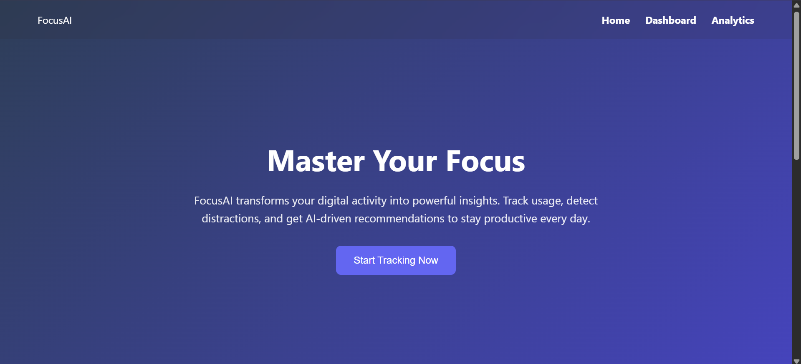
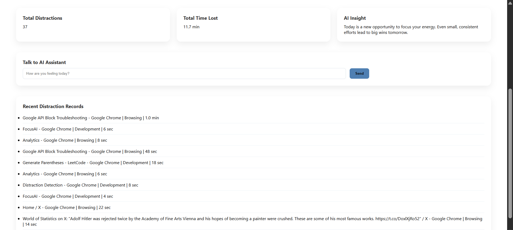
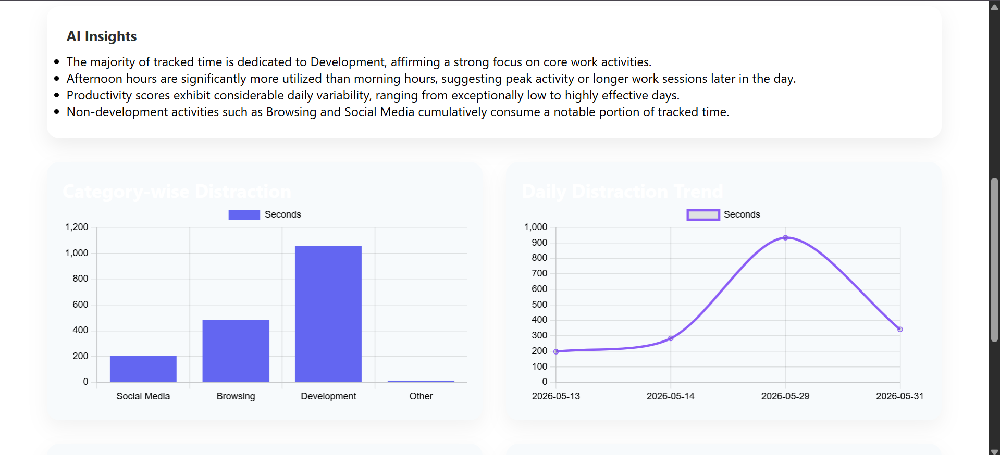
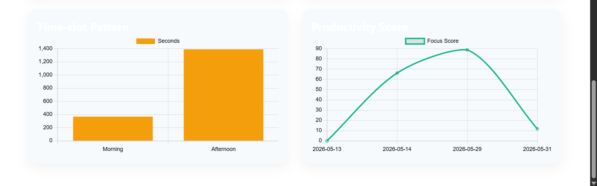

# FocusAI - AI-Powered Productivity Tracker

## Overview

FocusAI is an AI-powered productivity tracking application that helps users understand and reduce digital distractions. The system automatically monitors active applications, categorizes activities, records distraction patterns, and generates intelligent productivity insights using Google's Gemini AI.

The goal of the project is to provide users with actionable feedback about their focus habits through analytics, visualizations, and AI-generated recommendations.

---

## Features

### Activity Tracking

* Monitors active application windows in real time.
* Detects potentially distracting applications.
* Records application usage duration automatically.

### Smart Categorization

Applications are categorized into:

* Social Media
* Entertainment
* Browsing
* Development
* Work
* Other

### Productivity Dashboard

* View recent distraction records.
* Track total distractions.
* Monitor distraction duration.
* Interact with an AI productivity assistant.

### AI Productivity Assistant

* Powered by Google Gemini API.
* Provides personalized productivity suggestions.
* Responds to user queries related to focus and productivity.

### Analytics & Insights

* Category-wise distraction analysis.
* Daily distraction trends.
* Time-slot productivity patterns.
* Productivity score visualization.
* AI-generated productivity insights.

### Data Storage

* Uses SQLite for lightweight local storage.
* Automatically maintains distraction logs and analytics data.

---

## Tech Stack

### Backend

* Python
* Flask

### Database

* SQLite

### Frontend

* HTML
* CSS
* JavaScript
* Chart.js

### AI Integration

* Google Gemini API

---

## Project Structure

```text
FocusAI/
│
├── ai/
│   └── advisor.py
│
├── database/
│   └── db.py
│
├── tracker/
│   └── window_tracker.py
│
├── templates/
│   ├── home.html
│   ├── index.html
│   └── analytics.html
│
├── static/
│   └── css/
│      └── style.css
|
├── screenshots/
│   ├── home.png
│   ├── dasboard.png
|   ├── analytics_1.png
│   └── analytics_2.png
|
├── app.py
├── requirements.txt
├── seed_data.py
└── README.md
```

---

## Screenshots

### Home Page



### Dashboard



### Analytics Dashboard - Part 1



### Analytics Dashboard - Part 2



---

## Installation

### Clone Repository

```bash
git clone <repository-url>
cd FocusAI
```

### Install Dependencies

```bash
pip install -r requirements.txt
```

### Configure Environment Variables

Create a `.env` file in the project root:

```env
GEMINI_API_KEY=your_gemini_api_key
```

### Run Application

```bash
python app.py
```

Open:

```text
http://127.0.0.1:5000
```

---

## How It Works

1. The application tracks the currently active window.
2. Window titles are categorized into predefined activity groups.
3. Usage data is stored in SQLite.
4. Analytics are generated from historical activity data.
5. Gemini AI analyzes user productivity patterns and provides recommendations.
6. Interactive charts help visualize distraction trends and productivity behavior.

---

## Future Enhancements

* User Authentication
* Multi-user Support
* Weekly Productivity Reports
* PDF Report Generation
* Goal Tracking
* Productivity Streaks
* Cloud Database Integration
* Email Productivity Summaries

---

## Learning Outcomes

Through this project, I gained practical experience in:

* Flask Web Development
* SQLite Database Design
* AI API Integration
* Prompt Engineering
* Data Visualization
* Application Tracking and Monitoring
* Building End-to-End AI Applications

---
## Author

N Sai Niharika

---
## License

This project is intended for educational and portfolio purposes.
